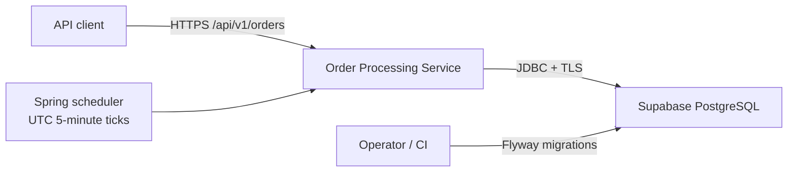
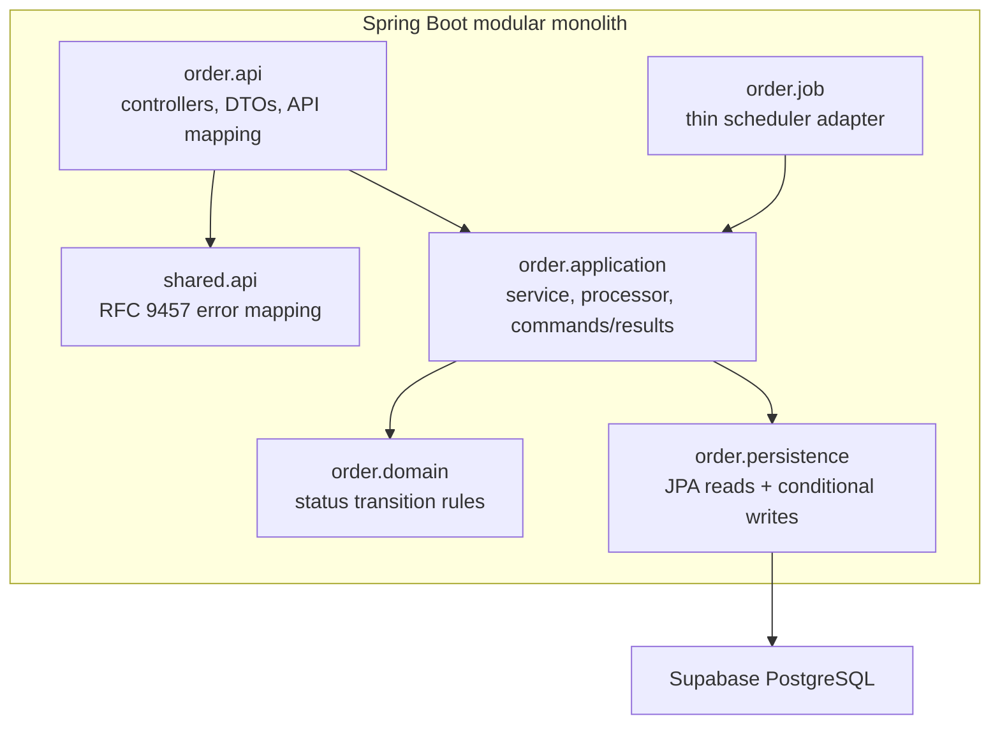
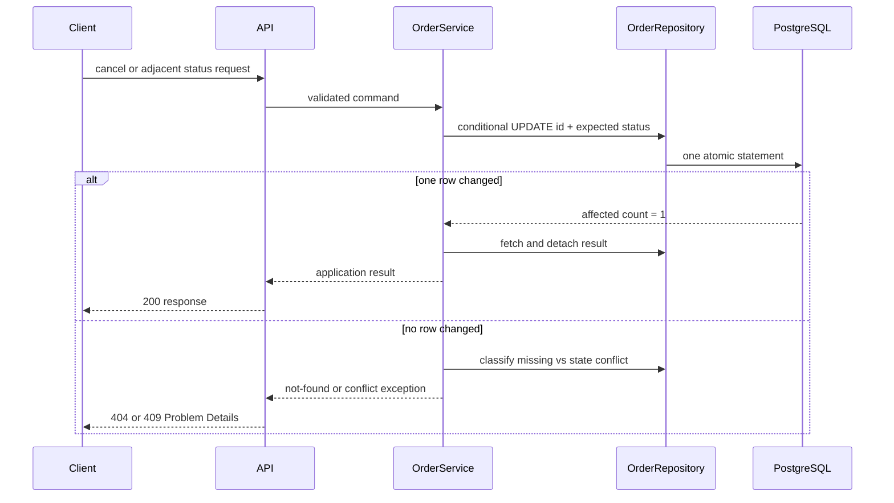
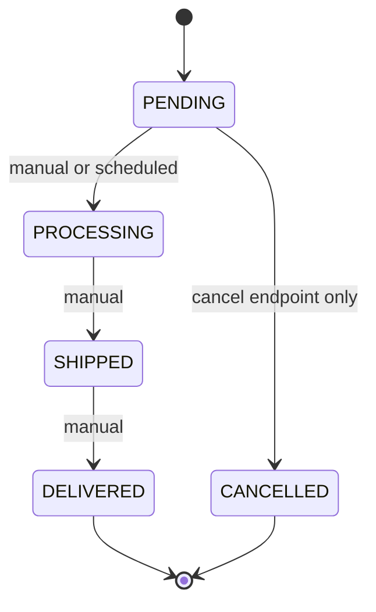

# Architecture

> **Status:** Planned; not implemented. This document is the target architecture.

## Canonical references

[Documentation index](INDEX.md) · [PRD](PRD.md) · [TRD](TRD.md) · [Data model](DATA_MODEL.md) · [Implementation plan](IMPLEMENTATION_PLAN.md) · [Test strategy](TEST_STRATEGY.md)

## Current and target state

The current repository contains a generated Spring Initializr scaffold at `backend/ordersystem/`: Java 21, Maven Wrapper, Spring Boot 4.1.0, and package `com.example.ordersystem.ordersystem`. It has no order behavior or persistence yet.

The target is a package-by-feature modular monolith rooted at `com.rkk.orderprocessing`. It exposes one versioned REST API and persists to Supabase-hosted PostgreSQL through JDBC. Flyway is the sole schema owner; Hibernate validates rather than creates or updates schema.

## Assumptions and success checks

- V1 has no customer identity, authentication, pricing, inventory, payment, or shipping integration.
- An order contains 1–100 immutable items; each exact, case-sensitive `productId` is unique within that order and has quantity 1–999.
- A successful design preserves only adjacent lifecycle transitions and never revives cancelled orders.
- API mutations and the five-minute worker remain correct with concurrent requests and multiple application replicas.
- The service can start without any Supabase SDK; database credentials come only from environment configuration.

## Decisions and alternatives

| Concern | Chosen approach | Alternative rejected / trade-off |
|---|---|---|
| Service boundary | Modular monolith, package by feature | Microservices add deployment and consistency cost to one small domain. |
| Persistence | Spring Data JPA over JDBC to Supabase PostgreSQL | Supabase REST/SDK adds an unnecessary data-access boundary; raw JDBC adds mapping boilerplate. |
| Schema | Versioned Flyway migrations; JPA `validate` | ORM auto-DDL is convenient locally but unsafe and unauditable. |
| Scheduling | In-process UTC cron at every minute divisible by five | External cron/queue improves availability but adds infrastructure outside the assignment. |
| Concurrency | Conditional SQL updates under PostgreSQL Read Committed | Read-then-write and row-by-row jobs create races; pessimistic locks reduce throughput. |
| API shape | Bounded offset pages, fixed newest-first order | Unbounded reads violate efficiency; cursor paging is stronger under churn but unnecessary for V1. |

## System context

## Component model

Target code lives below `backend/ordersystem/src/main/java/com/rkk/orderprocessing/`; migrations live in `backend/ordersystem/src/main/resources/db/migration/`. Controllers own HTTP translation, application use cases own transactions and aggregate validation, `OrderStatus` owns lifecycle rules, and repositories own entities and query mechanics. API mapping crosses only immutable application commands/results; API code never imports persistence. The scheduler invokes the application processor through a separate Spring bean so transaction interception is effective. No controller or scheduler contains lifecycle policy.

## Runtime flows and transaction boundaries

- **Create:** named entity creation methods build one valid pending aggregate; one transaction writes the order and all items, and any failure rolls it back.
- **Detail/list:** read-only transactions. List uses `page=0`, `size=20`, maximum 100, ordered by `created_at DESC, id DESC`.
- **Manual transition/cancel:** one conditional update plus response read in one transaction. The SQL predicate includes the required source status.
- **Scheduled processing:** the time adapter calls a separate application processor; one transaction bulk-updates every row still `PENDING` to `PROCESSING`. The trigger contains no business logic.

At Read Committed, PostgreSQL waits on a concurrently changed row and re-evaluates the `WHERE` predicate. Therefore cancellation versus scheduling, duplicate transitions, and overlapping scheduler replicas have one effective winner; losers update zero rows. A failed job rolls back and the next tick retries remaining `PENDING` rows.

## Lifecycle

All self-transitions, skips, reversals, and transitions out of terminal states return a conflict. `PATCH .../status` cannot cancel.

## Operational boundaries and risks

Use TLS for Supabase connections, least-privilege database credentials, strict boundary validation, parameterized queries, and logs without request bodies or secrets. Emit trace IDs, request outcomes, job duration, and affected-row counts. Health checks distinguish application liveness from database readiness.

The in-process scheduler does not run while every replica is down; this is accepted for V1 because the next tick catches up. Offset pages can shift under concurrent inserts, and lack of authentication means the API must not be internet-exposed as a production multi-user service. Revisit external scheduling, cursor pagination, and identity only when requirements demand them.
