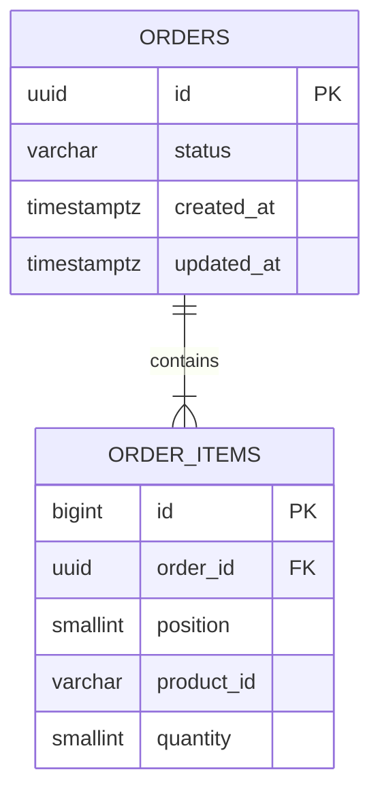

# Data Model

> **Status:** Implemented by Flyway `V1__create_orders.sql` and verified against Testcontainers and local Supabase PostgreSQL. Flyway is the only schema writer.

## Canonical references

[Documentation index](INDEX.md) · [PRD](PRD.md) · [TRD](TRD.md) · [Architecture](ARCHITECTURE.md) · [Implementation plan](IMPLEMENTATION_PLAN.md) · [Test strategy](TEST_STRATEGY.md)

## Scope and ownership

The V1 PostgreSQL schema is accessed by Spring Data JPA through JDBC. It stores
orders and immutable line items only; it deliberately has no customer, price,
inventory, payment, address, or audit-event tables. IDs and UTC timestamps are
generated server-side. Local Supabase uses the same verified Flyway schema path.

## Tables

### `orders`

| Column | PostgreSQL type | Null | Default / rule |
|---|---|---:|---|
| `id` | `uuid` | No | Application-generated primary key. |
| `status` | `varchar(16)` | No | `PENDING` at creation; check constrained to the five known values. |
| `created_at` | `timestamptz` | No | Application-supplied UTC instant; no database default. |
| `updated_at` | `timestamptz` | No | Changed with every status mutation; must not precede `created_at`. |

Allowed persisted statuses are `PENDING`, `PROCESSING`, `SHIPPED`, `DELIVERED`, and `CANCELLED`. The database constrains vocabulary; the application and conditional update predicates enforce transition order.

### `order_items`

| Column | PostgreSQL type | Null | Default / rule |
|---|---|---:|---|
| `id` | `bigint` | No | Identity primary key; internal and never exposed. |
| `order_id` | `uuid` | No | Foreign key to `orders(id)` with `ON DELETE CASCADE`. No delete API exists. |
| `position` | `smallint` | No | Submission order, 0–99. |
| `product_id` | `varchar(100)` | No | Opaque, nonblank, 1–100 Unicode code points; preserved and compared exactly/case-sensitively. |
| `quantity` | `smallint` | No | Check constrained to 1–999. |

`UNIQUE (order_id, product_id)` rejects duplicate products and `UNIQUE (order_id, position)` preserves one item per position. Position bounds plus uniqueness cap an order at 100 rows. The application service and `OrderEntity.createPending` reject item counts outside 1–100 before persistence because a portable row constraint cannot require a parent to have a child.

## Constraints and indexes

| Name | Definition | Purpose |
|---|---|---|
| `pk_orders` | primary key on `orders(id)` | Detail lookup and mutation identity. |
| `ck_orders_status` | status in the five-value set | Reject unknown persisted states. |
| `ck_orders_timestamps` | `updated_at >= created_at` | Preserve temporal consistency. |
| `idx_orders_created_id` | `(created_at DESC, id DESC)` | Stable unfiltered newest-first pages. |
| `idx_orders_status_created_id` | `(status, created_at DESC, id DESC)` | Exact-status filtered pages. |
| `pk_order_items` | primary key on `order_items(id)` | JPA identity. |
| `fk_order_items_order` | `order_id` references `orders(id)` | Aggregate integrity. |
| `uq_order_items_product` | unique `(order_id, product_id)` | Duplicate-product defense in depth. |
| `uq_order_items_position` | unique `(order_id, position)` | Stable response item ordering and 100-item cap. |
| `ck_order_items_product` | `char_length(product_id)` 1–100, `btrim(product_id)` nonempty, and no U+0000 can be represented by PostgreSQL text | Reject invalid identifiers at the final storage boundary; Java additionally owns its broader Unicode blank rule. |
| `ck_order_items_quantity` | quantity between 1 and 999 | Quantity defense in depth. |
| `ck_order_items_position` | position between 0 and 99 | Bound aggregate size. |

No separate `status` index is planned: the filtered-list composite index begins with `status` and supports locating `PENDING` rows. Index usage must be confirmed with representative `EXPLAIN (ANALYZE, BUFFERS)` data before adding another write-costly index.

## Mapping and query rules

- Plain Java `OrderStatus` owns the framework-independent transition rule.
- `OrderEntity` and `OrderItemEntity` in `order.persistence` map status as a string enum, timestamps as `Instant`, and items as an ordered child collection with cascade persist. `OrderEntity.createPending` enforces the aggregate's 1–100 item cardinality before attaching children. `OrderRepository` is the Spring Data repository and owns the conditional mutations; no duplicate domain aggregate or repository adapter is planned.
- Items never change after creation. Status changes do not rewrite child rows.
- The application `Clock` is the sole timestamp authority: create supplies one
  instant for both order timestamps and every conditional mutation supplies its
  new `updated_at`. `NOT NULL` constraints intentionally reject writes that omit
  those values; database clock defaults must not hide an application error.
- Detail reads load one aggregate. Paged list reads order rows by the fixed composite sort and should return summaries; item collections are not join-fetched into a pageable query.
- Flyway migration `V1__create_orders.sql` creates both tables, constraints, and indexes. Hibernate runs with schema validation only.

## Atomic mutation model

Manual transitions use statements shaped as `UPDATE orders SET ..., updated_at = GREATEST(updated_at, ?) WHERE id = ? AND status = ?`; cancellation requires `status = 'PENDING'`. The scheduled handler performs one set-based `UPDATE` with `WHERE status = 'PENDING'`. The monotonic expression prevents backward application-clock movement from violating the timestamp constraint.

No version column or database trigger is needed: all mutable state is the single status field, and compare-and-set predicates prevent lost updates. PostgreSQL Read Committed row locking and predicate re-evaluation make competing cancellation, transition, and scheduler operations safe. Lifecycle rules and the exact SQL predicates are specified in [Architecture](ARCHITECTURE.md); database race cases are specified in [Test strategy](TEST_STRATEGY.md).
