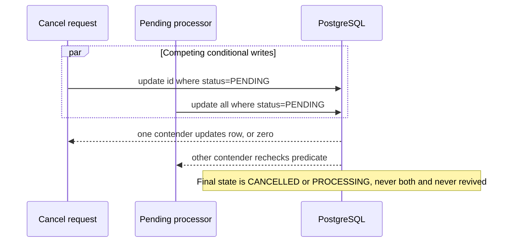

# Low-Level Design

> **Status:** Implemented and verified for V1. This is the canonical implementation-shape document.

## 1. Scope and References

This LLD realizes the behavior in [PRD](PRD.md) within the boundaries in [Architecture](ARCHITECTURE.md). HTTP fields belong to [API Contract](API_CONTRACT.md), storage details to [Data Model](DATA_MODEL.md), platform rules to [TRD](TRD.md), and verification to [Test Strategy](TEST_STRATEGY.md).

The implementation now lives under `com.rkk.orderprocessing` and follows the
package map below. The generated `com.example.ordersystem.ordersystem` package
has been removed. The remaining delivery gates are tracked in
[Implementation Plan](IMPLEMENTATION_PLAN.md) and [Test Strategy](TEST_STRATEGY.md).

## 2. Design Principles

- One package-by-feature modular monolith and one deployable process.
- Controllers translate HTTP; services own transactions; repositories own database mechanics; schedulers only trigger handlers.
- API DTOs never expose JPA entities. API code depends on immutable application commands/results and never imports `order.persistence`.
- JPA entities are not duplicated as a second domain aggregate; named creation methods keep aggregate construction valid.
- `OrderStatus` is the single framework-independent lifecycle policy.
- PostgreSQL constraints and conditional writes defend invariants at the final trust boundary.
- Prefer JDK, Spring, and PostgreSQL capabilities over custom frameworks, command buses, or generic base layers.
- Add an interface or pattern hierarchy only when a current requirement has multiple implementations. Composition and constructor injection are the default.
- Spring beans use the default singleton scope only when stateless: injected collaborators are final, and request, order, transaction, or job state never lives in fields.

## 3. Target Package Map

```text
backend/ordersystem/src/main/java/com/rkk/orderprocessing/
├── OrderProcessingApplication.java
├── config/
│   ├── ClockConfiguration.java
│   └── SchedulingConfiguration.java
├── shared/api/
│   ├── ApiExceptionHandler.java
│   └── RequestTraceFilter.java
└── order/
    ├── api/
    │   ├── OrderController.java
    │   ├── OrderApiMapper.java
    │   └── dto/
    │       ├── CreateOrderRequest.java
    │       ├── CreateOrderItemRequest.java
    │       ├── UpdateOrderStatusRequest.java
    │       ├── OrderResponse.java
    │       ├── OrderItemResponse.java
    │       ├── OrderSummaryResponse.java
    │       └── OrderPageResponse.java
    ├── application/
    │   ├── CreateOrderCommand.java
    │   ├── OrderDetailsResult.java
    │   ├── OrderPageResult.java
    │   ├── OrderResultMapper.java
    │   ├── OrderService.java
    │   ├── PendingOrderProcessor.java
    │   ├── InvalidOrderException.java
    │   ├── OrderNotFoundException.java
    │   └── OrderStateConflictException.java
    ├── domain/
    │   └── OrderStatus.java
    ├── persistence/
    │   ├── OrderEntity.java
    │   ├── OrderItemEntity.java
    │   └── OrderRepository.java
    └── job/
        └── PendingOrderScheduler.java
```

Migrations live in `backend/ordersystem/src/main/resources/db/migration/`. Tests mirror these packages under `src/test/java`.

Allowed source dependencies are `api -> application`, `job -> application`, `application -> domain/persistence`, and `persistence -> domain`. `domain` imports no Spring, JPA, HTTP, or persistence type. The scheduler and controller are independent inbound adapters; neither calls the other.

## 4. Class Responsibilities

| Class/type | Responsibility | Must not do |
| --- | --- | --- |
| `OrderProcessingApplication` | Spring Boot entry point | Business logic or data seeding |
| `ClockConfiguration` | Provide one injectable UTC-capable `Clock` | Read time through static calls in business code |
| `SchedulingConfiguration` | Enable scheduling and conditionally register the job when `ORDERS_SCHEDULER_ENABLED` is true | Decide cadence or which rows are eligible |
| `OrderStatus` | Declare five statuses, legal adjacent target, and terminal state | Access Spring, JPA, or HTTP |
| `OrderEntity` | Map the aggregate and provide `createPending(...)` to set `PENDING`, timestamps, child order, and parent links | Accept API DTOs or decide transitions |
| `OrderItemEntity` | Map item data and provide a named creation method for a validated item value | Have an independent repository/lifecycle |
| `OrderRepository` | JPA detail/list reads and explicit conditional mutations | Implement product policy or expose entities to controllers |
| Application command/result records | Carry persistence-free use-case input/output; nested item/summary records avoid extra files | Carry HTTP or JPA annotations |
| `OrderResultMapper` | Convert entities/projections to detached application results while the transaction is open | Return API DTOs or query the database |
| `OrderService` | Act as the use-case facade: validate rules, own transactions, and classify 404/409 | Schedule itself, expose entities, or build HTTP responses |
| `PendingOrderProcessor` | Run the transactional set-based pending update and return affected count | Poll/save rows individually |
| `PendingOrderScheduler` | Own the fixed `@Scheduled(cron = "0 */5 * * * *", zone = "UTC")` adapter and invoke the processor | Contain transaction or lifecycle rules |
| `OrderController` | Validate inputs, call service, set HTTP status/headers | Open transactions or access repositories |
| Request/response records | Define immutable HTTP boundary | Carry persistence annotations |
| `OrderApiMapper` | Convert API requests to commands and application results to responses | Import persistence types, query data, or enforce business rules |
| `ApiExceptionHandler` | Produce stable problem-details responses | Leak SQL, stack traces, or secrets |

All Spring components above are stateless, constructor-injected singleton beans. JPA entities and persistence contexts remain transaction-local and are never cached in singleton fields. `Clock.systemUTC()` is immutable; any mutable test clock is test-local.

## 5. Application and Repository Contracts

The application surface is concrete and small; no one-implementation service interface or command bus is planned.

| Operation | Contract | Transaction |
| --- | --- | --- |
| `OrderService.create(CreateOrderCommand)` | Return `OrderDetailsResult`; reject invalid aggregate input | Read-write |
| `OrderService.get(UUID)` | Return detached detail or throw `OrderNotFoundException` | Read-only |
| `OrderService.list(String?, int page, int size)` | Parse an optional exact status and return `OrderPageResult`; choose filtered or unfiltered summary query | Read-only |
| `OrderService.advanceStatus(UUID, String)` | Parse the target, apply the one legal predecessor rule, and return detail, 404, or 409 | Read-write |
| `OrderService.cancel(UUID)` | Compare-and-set `PENDING -> CANCELLED`; return detail, 404, or 409 | Read-write |
| `PendingOrderProcessor.processPending()` | Bulk-update pending rows using one timestamp; return affected count | Read-write |

`OrderRepository` provides aggregate detail lookup, filtered and unfiltered summary-page projections, existence lookup, `save`, one expected-status mutation, and one pending bulk mutation. Mutation methods return affected row counts and clear the persistence context before any response fetch. One private `OrderService` helper performs conditional update -> detail fetch on success -> existence classification on zero, so advance and cancel cannot drift.

Spring transaction proxies commit after a successful public service/processor method returns and before its caller resumes. The method builds an immutable application result while persistence data is available; controller serialization never relies on an open persistence context.

## 6. Domain Invariants

- A new order starts as `PENDING` with a service-generated UUID and one UTC timestamp used for both `createdAt` and `updatedAt`.
- An order contains 1–100 items. Items are immutable after creation.
- `productId` is case-sensitive, trimmed only for blank validation, 1–100
  Unicode code points, and unique within an order. Java validates with
  `String.codePointCount(...)`, not UTF-16 `String.length()`/`@Size`; PostgreSQL
  uses `char_length`. Combining sequences are not normalized, and their code
  points count separately. U+0000 is rejected because PostgreSQL text values
  cannot store it.
- `quantity` is an integer from 1 through 999.
- V1 stores no customer, price, currency, total, inventory, payment, address, or status history.
- Cancellation changes status; it never deletes data.

## 7. Lifecycle Contract

`PATCH /status` permits only the next fulfilment status. `CANCELLED` is accepted only by the cancel endpoint.

| Persisted state \ requested target | `PENDING` | `PROCESSING` | `SHIPPED` | `DELIVERED` | `CANCELLED` |
| --- | ---: | ---: | ---: | ---: | ---: |
| `PENDING` | 409 | **200** | 409 | 409 | 409 |
| `PROCESSING` | 409 | 409 | **200** | 409 | 409 |
| `SHIPPED` | 409 | 409 | 409 | **200** | 409 |
| `DELIVERED` | 409 | 409 | 409 | 409 | 409 |
| `CANCELLED` | 409 | 409 | 409 | 409 | 409 |

The cancel endpoint returns 200 only from `PENDING`; every other existing state returns 409. `CANCELLED` through the generic endpoint is a business conflict; an unknown target string returns 400 before service logic. `OrderStatus.requiredPredecessorForManualTarget()` (or an equivalently explicit method) is the sole table-driven rule used by manual advancement.

For a valid UUID with a known but never-manual target (`PENDING` or `CANCELLED`),
target validation wins and returns 409 even when the order does not exist. A
missing order is 404 only after a target with a legal predecessor reaches the
conditional mutation.

## 8. Use-Case Flows and Transactions

### Create

1. HTTP validation checks item count, product ID, quantity, and unknown fields; `OrderApiMapper` creates a `CreateOrderCommand`.
2. `OrderService` rejects exact duplicate product IDs before persistence work.
3. One `Clock.instant()` and UUID are assigned; named item/aggregate creation methods establish positions, parent links, initial status, and timestamps.
4. One transaction persists the parent and all children through cascade persist.
5. `OrderResultMapper` creates a detached result. After commit, the API mapper creates the response and the controller returns 201 with `Location`.

Any failure rolls back parent and items. Create retries are not deduplicated in V1.

### Detail and list

- Detail is a read-only transaction using a dedicated aggregate fetch and returns a detached application result without Open EntityManager in View.
- List is a read-only summary projection; it does not join-fetch item collections into a pageable query.
- Pagination is zero-based, defaults to 20, caps at 100, and always sorts by `created_at DESC, id DESC`.

### Manual transition

1. `OrderStatus` maps the requested target to its one legal predecessor.
2. The shared transition helper asks the repository for one conditional mutation by `id` and predecessor status, setting target and `updated_at = GREATEST(updated_at, :clockInstant)` so a backward clock cannot violate timestamp monotonicity.
3. Affected count 1 means success; the helper fetches and maps updated detail in the same transaction.
4. Affected count 0 triggers an existence check: absent is 404, present is 409.

### Cancellation

The same algorithm uses the fixed predicate `id = :id AND status = PENDING` and target `CANCELLED`.

### Pending processor

1. Scheduler fires at `0 */5 * * * *` in UTC.
2. Processor captures one `Clock.instant()`.
3. One transaction updates every row still `PENDING` to `PROCESSING` and sets each `updated_at` to the greater of its current value and the captured clock instant.
4. Processor returns the affected count. After its transactional proxy returns,
   the scheduler records success, affected rows, and duration; failed commits
   take the failure metric/log path. Immediate rerun affects zero.

This is a schedule tick, not an “order is five minutes old” threshold.
Eligibility follows PostgreSQL Read Committed statement visibility: a `PENDING`
order committed before the bulk `UPDATE` statement snapshot is eligible; one
committed after the statement begins remains `PENDING` until the next successful
tick. The processor does not loop to absorb orders arriving during its own run.

## 9. Concurrency Model



PostgreSQL Read Committed waits on a conflicting row and re-evaluates the `WHERE` condition after the winner commits. Status is the only mutable business field, so no optimistic-version column, distributed scheduler lock, or `SELECT FOR UPDATE` is required. Separate real-PostgreSQL tests must prove cancel/job, transition/transition, and job/job races.

Bulk mutations clear the persistence context before a response fetch. Singleton services remain safe during overlap because they hold no mutable operation state; correctness lives in transaction-local data and database predicates.

V1 publishes no domain or integration events. Metrics/logging observe completed outcomes but are not business side effects. A future required external effect needs a transactional outbox decision; it must not be implemented as an in-transaction or best-effort Spring event listener.

## 10. Validation and Error Mapping

| Condition | Application result | HTTP |
| --- | --- | ---: |
| Malformed JSON/UUID/enum, unknown field, invalid item/page/size | `INVALID_REQUEST` | 400 |
| Valid order ID absent | `ORDER_NOT_FOUND` | 404 |
| Existing order cannot make requested transition/cancel, including lost race | `ORDER_STATE_CONFLICT` | 409 |
| Unexpected failure | Sanitized `INTERNAL_ERROR` plus trace ID | 500 |

Controllers rely on Jakarta Validation for structural limits; the service enforces cross-item uniqueness; PostgreSQL repeats critical checks. Exact fields are in [API Contract](API_CONTRACT.md).

## 11. Necessary Pattern Decisions

Patterns are selected for a present responsibility, not to maximize pattern count.

| Pattern | Concrete use now | Why it is necessary |
| --- | --- | --- |
| Application Service / Facade | `OrderService` is the single API-facing use-case surface | Keeps transactions and 404/409 classification out of controllers |
| Repository | `OrderRepository` owns JPA reads and conditional SQL mutations | Isolates storage mechanics and enables focused service tests |
| Immutable Command/Result + Mapper | API DTO -> command -> application result -> API DTO | Prevents JPA leakage and allows API/persistence changes independently |
| Named static factory | Entity creation methods establish a valid pending aggregate | Centralizes initial status, timestamps, positions, and parent links without a factory hierarchy |
| Enum state machine | `OrderStatus` owns the fixed transition table | One auditable lifecycle rule replaces scattered conditionals |
| Adapter | Controller and scheduler are HTTP/time adapters around application use cases | Keeps framework triggers thin and directly testable |
| Dependency Injection / managed singleton | Spring constructs stateless components and injects `Clock`/collaborators | Supports deterministic tests and safe reuse; no manual Singleton implementation |
| Transaction Script + compare-and-set | Each use case is one transaction; mutations include expected status | Fits a small domain and solves real concurrency races with minimum machinery |

The following classic patterns are deliberately **not** introduced yet:

| Pattern | Why deferred | Introduce only when |
| --- | --- | --- |
| Strategy interface | There is one fixed fulfilment policy | Two or more policies must be selected at runtime, such as order-type-specific workflows |
| Observer / Spring events | V1 has no event consumer; listener timing and failure semantics would be artificial | A non-critical local after-commit consumer exists; use an outbox instead for reliable external effects |
| GoF State classes | Five enum values and one linear table do not justify one class per state | State-specific behavior grows beyond a readable table |
| Abstract Factory / Builder | Aggregate creation has one short path | Multiple genuinely different construction families or many optional fields exist |
| Command bus, Template Method, generic base layers | Direct method calls and composition are clearer | Several use cases have proven repeated mechanics that cannot be shared by a small helper |
| Specification | Listing has only one optional filter | Multiple independent filters create duplicated query branching |

No manual singleton, mutable static state, speculative event, or one-implementation interface may be added merely to claim a pattern.

## 12. Extension Playbook

| Change | First extension point | Pattern threshold |
| --- | --- | --- |
| Add one lifecycle status | Update `OrderStatus`, Flyway constraint, API contract, and full transition matrix | Keep the enum table unless a second policy appears |
| Add order-type-specific workflows | Preserve service/repository contracts and extract transition policy behind a Strategy | Require at least two runtime-selected policies |
| Add another list filter | Add one explicit repository query and supporting index evidence | Introduce Specification only when combinations begin duplicating branches |
| Add a local non-critical reaction | Publish an immutable event after commit | Observer is allowed only with a named consumer and failure policy |
| Add payment, inventory, or notification delivery | Write an outbox record in the order transaction and process separately | Requires a new ADR; plain Observer is insufficient |
| Add a second persistence technology | Extract an application-owned persistence port and adapter | Do not create ports for a hypothetical second store |

## 13. LLD Acceptance Evidence

The canonical documents agree with this class inventory and changed assumptions
are recorded in their owners. Automated verification proves aggregate factory
invariants, the full state matrix, detached mapper boundary, shared transition
classification, scheduler-to-processor wiring, statement-snapshot behavior, and
PostgreSQL races. Architecture tests prove that API code does not import
persistence, `job` contains only the time adapter, and singleton beans remain
stateless. Exact build and smoke evidence is recorded in the test strategy and
`RESUME.md`.
